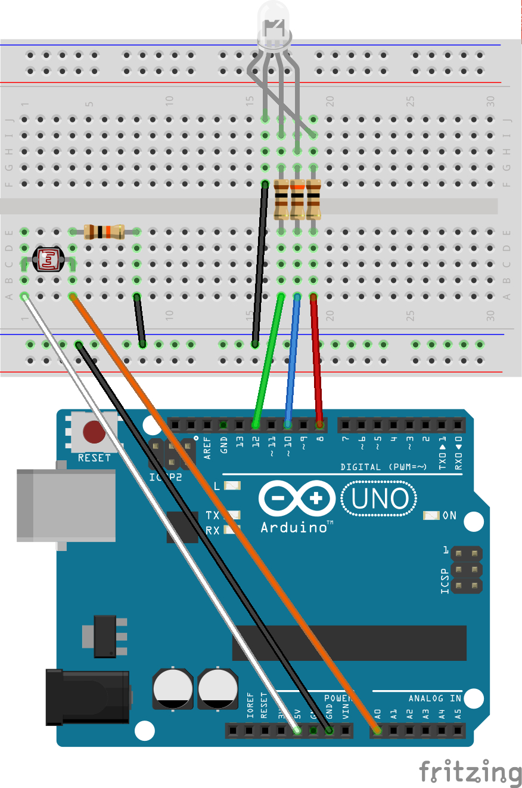

Instalação
==========
As seções à seguir explicarão como instalar a aplicação desenvolvida
para o estudo.

blueberry (*Raspberry Pi*)
--------------------------
O código da aplicação para servidor e cliente *Python* se encontra no
repositório `blueberry`_ e para ser instalado basta utilizar o
`pip`_::

    pip install blueberry-network

Nenhuma outra ação é necessária. A aplicação será instalada
corretamente.

Servidor
''''''''
O servidor utilizado pela aplicação foi executado por um *notebook*
capaz de interpretar *scripts* em *Python* e com uma placa *Bluetooth*
devidamente instalada. Qualquer servidor capaz de atender tais
requisitos irá executar a aplicação.

Cliente
'''''''
O cliente utilizado pela aplicação foi executado por um
`Raspberry Pi`_ com um adaptador *Bluetooth* e um `Arduino UNO`_
conectados à suas portas USB.

Sensor de Luminosidade
``````````````````````
Um *Arduino UNO* realizou a leitura do sensor de luminosidade e
utilizou a comunicação serial para informar o nível lido. Basta
programar o projeto ``arduino`` localizado dentro do repositório
`blueberry`_ e montar o circuito ilustrado pela
:numref:`fig-arduino`. O nível lido pelo sensor é mapeado para ser
exibido por um LED RGB, variando entre vermelho (baixo), azul (médio)
e verde (alto). Entretanto, ele não é necessário para o funcionamento
do cliente.

.. _fig-arduino:



   Leitor de Luminosidade

Com o circuito montado, só resta conectar o *UNO* à uma das portas USB
do *Raspberry Pi*.

.. note::

    Apesar da aplicação ter utilizado um *Arduino UNO*, qualquer
    implementação que leia tal sensor pode ser utilizada, basta
    adaptar o módulo ``sensor`` para corresponder ao circuito montado.

TrabalhoFaculSDAppAndroidBT (*Android*)
---------------------------------------
O código da aplicação para clientes *Android* se encontra no
repositório `TrabalhoFaculSDAppAndroidBT`_. Basta ter o SDK do
*Android* instalado, clonar o repositório, compilar e instalar o
aplicativo.

.. _`arduino uno`: https://www.arduino.cc/en/Main/ArduinoBoardUno
.. _`blueberry`: https://github.com/felipedau/blueberry
.. _`pip`: https://pypi.python.org/pypi/pip
.. _`pybluez`: https://pypi.python.org/pypi/PyBluez
.. _`raspberry pi`: https://www.raspberrypi.org/help/what-is-a-raspberry-pi
.. _`trabalhofaculsdappandroidbt`: https://github.com/GuDiasOliveira/TrabalhoFaculSDAppAndroidBT
