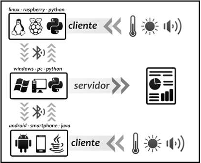

Sobre
=====

Proposto pelo professor Rogério Santos Pozza que ministra a
disciplina de Sistemas Distribuídos da UTFPR do Campus Cornélio
Procópio, os alunos de Engenharia de Computação realizaram um estudo
sobre o padrão IEEE 802.15.1 a fim de não só levantar informações e
compará-lo aos padrões IEEE 802.15.4 e IEEE 802.15.6, mas também
implementar uma aplicação capaz de estabelecer uma rede sem fio por
meio da tecnologia *Bluetooth*.

O projeto desenvolvido para esse trabalho é composto de um servidor e
um cliente escritos em *Python* e um outro cliente escrito em *Java*.
Para essa aplicação serão transmitidos por *Bluetooth* dados dos
níveis de luminosidade captados pelos clientes, enquanto o servidor
tem a missão de receber tais dados e exibir as informações conforme
são coletadas. O esquema montado pode ser visto na
:numref:`fig-aplicacao`.

.. _fig-aplicacao:

   Esquema da Aplicação Bluetooth

Para o experimento realizado, foram utilizados três dispositivos: um
servidor executado por um computador com sistema operacional
*Windows*, um cliente (escrito em *Python*) executado por um *Raspberry
Pi* com o sistema operacional *Linux* e um cliente (escrito em *Java*)
e executado por um dispositivo *Android*. Por ser mais conveniente, a
leitura do nível de luminosidade feita pelo *Raspberry Pi* é
realizada por um *Arduino* que informa a leitura por comunicação
*serial* pela porta USB. No caso do smartphone, utiliza-se a API do
*Android* para a leitura que controla o próprio sensor do
dispositivo, sem necessidade de qualquer outro periférico ou
componente adicional. Toda essa diferença de dispositivos não
prejudica o bom funcionamento do sistema, pois está se utillizando
dos protocolos estipulados pelo RFCOMM do *Bluetooth*. O RFCOMM é
autenticado por um número UUID (*universally unique identifier*)
identificador único universal, que é o mesmo entre o servidor e os
clientes. O servidor pode ser executado por qualquer computador que
possua conexão *Bluetooth* e interprete *scripts* em *Python* (e.g.,
*notebook*, *Raspberry Pi*). Com relação aos clientes, o primeiro
tipo pode ser executado por qualquer dispositivo com as mesmas
características necessárias para um servidor, além de um periférico
que leia um sensor de luminosidade, enquanto o segundo tipo pode ser
executado por qualquer dispositivo *Android* que possua um sensor de
luminosidade e conexão *Bluetooth*.
